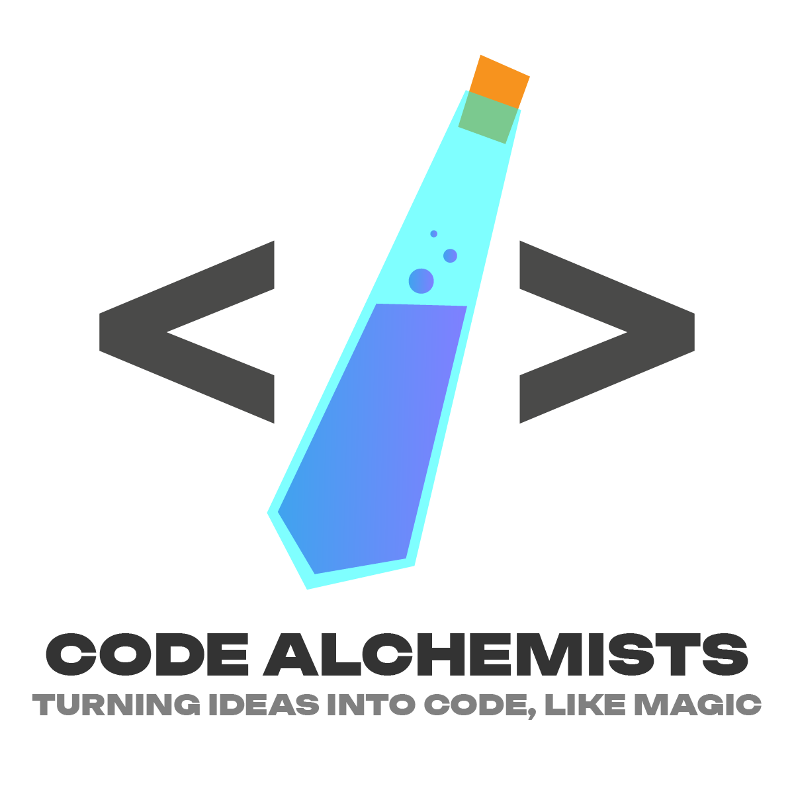

  

# Documentazione Team Code Alchemists
All'interno di questa repository GitHub è possibile trovare tutta la documentazione prodotta dal team <b>"Code Alchemist"</b>, 21° gruppo.

Pagina di Visualizzazione: <a href="https://teamcodealchemists.github.io" target="_blank">Code Alchemists</a>

Università degli Studi di Padova 
Dipartimento di Matematica 
Corso di Laurea in Informatica (L-31) 
Ingegneria del Software 
Anno Accademico: 2024/2025 

## Glossario
Per aggiornare il glossario basta semplicemente eseguire l'action manualmente o effettuare un push sulla branch main.
